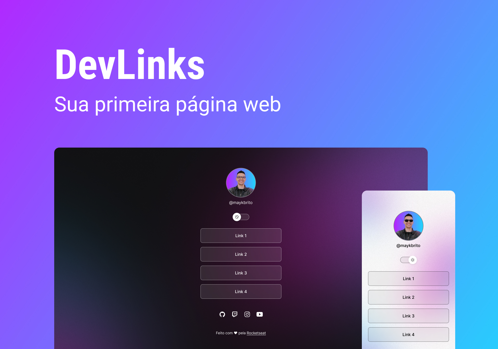

<h1 align="center">
  DevLinks
</h1>

  Programa exclusivo e gratuito promovido pela Rocketseat para ensino de tecnologias WEB

  <a href="#-tecnologias">Tecnologias</a>&nbsp;&nbsp;&nbsp; | &nbsp;&nbsp;&nbsp;
  <a href="#-projeto">Projeto</a>

  

## 🚀 Tecnologias

Esse projeto foi desenvolvido com as seguintes tecnologias:

- HTML e CSS
- JavaScript
- Git e Github
- Figma

## 💻 Projeto

O DevLinks é um agregador de links (linktree) para usar como cartão de visitas online.

---

Feito pela <strong>Orumaito Gang</strong> 💪